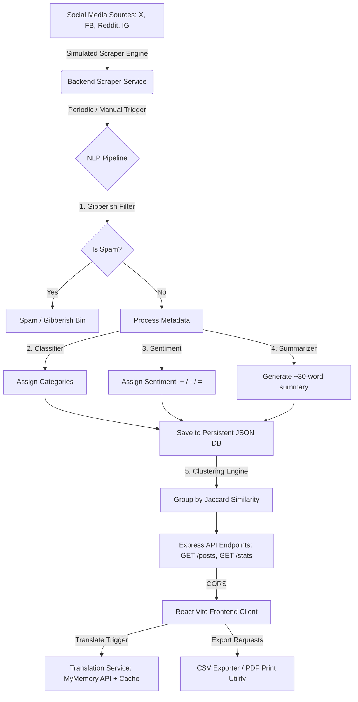

# Social Media Passport Scraper Dashboard
**Zebvo Newswire Private Limited** — Full-Stack Development Assignment  
*Jalandhar, Punjab, India | [zebvo.com](https://zebvo.com)*

A professional, high-fidelity full-stack dashboard designed to aggregate, analyze, translate, and organize social media posts related to passport services published in the last 24 hours. The application leverages Node.js, Express, React, and custom NLP heuristics to filter spam, auto-categorize topics, perform sentiment analysis, cluster duplicate posts, and translate text into 10 target languages.

---

## 🚀 Key Features

*   **Real-Time Scraper Simulation**: Periodically gathers posts about passport topics across Twitter/X, Facebook, Instagram, LinkedIn, YouTube, Reddit, and TikTok. A background scheduler injects new posts, and a manual "Scrape Live Feed" trigger allows on-demand aggregation.
*   **Gibberish Filter**: High-performance character-density, token-ratio, and entropy-checking algorithms flag and separate random keyboard-mash posts, bot spam, and link-promotion schemes.
*   **Auto-Categorisation**: Weighted token classifiers map text content under 10 topological categories (Application, Renewal, Appointments, Tatkal, Visa, Travel Issues, Government Announcements, Scams/Fraud, News, Personal Experiences).
*   **AI-Driven Summary**: Generates concise, ~30-word summaries for aggregated social posts.
*   **Clustered Duplicate View**: Uses token-level Jaccard Similarity index calculation ($J(A, B) = \frac{|A \cap B|}{|A \cup B|}$) to thread matching or highly duplicate posts under a single card, preventing feed redundancy.
*   **One-Click Translation**: Translates posts into 10 target languages (English, Hindi, Punjabi, Spanish, French, German, Arabic, Chinese, Russian, Japanese) utilizing a free translation API with offline-first, pre-cached template fallbacks.
*   **Dashboard Intelligence Analytics**: Interactive, glassmorphic analytics panel plotting volume timelines, category allocations, platform distribution, and positive/negative sentiment trends.
*   **Data Export Utilities**: Supports printing/exporting results to raw CSV spreadsheets or clean, print-formatted PDF reports.

---

## 📐 System Architecture & Data Flow



### Data Pipeline Flow:
1.  **Ingestion**: Scraper aggregates raw social feeds containing platform tags, text, timestamps, engagement metadata (likes, shares, comments), and location metrics.
2.  **Spam Filtering**: The text goes through a regex and ratio engine checking for excessive consonant sequences, character repetitions, and random alphanumeric string thresholds. If classified as gibberish, it goes to the spam partition.
3.  **NLP Parsing**: Clean posts are scored against a vocabulary vectors database to determine categories and sentiment rating (Positive/Negative/Neutral). A keyword extraction script outputs a summary.
4.  **Clustering**: The clustering engine tokenizes texts, filters common English and Indian stopwords, and determines shingle similarity. High-similarity threads are grouped together under a "lead" post.
5.  **Visualization**: The React UI uses Recharts to read statistic endpoints and displays the aggregated data on glassmorphic cards.

---

## 📂 Project Structure

```
Zebco2311981617/
├── backend/
│   ├── db/
│   │   └── store.json             # Persistent file-based JSON store
│   ├── docs/
│   │   └── postman_collection.json # API endpoints collection
│   ├── routes/
│   │   └── api.js                 # Express router (posts, stats, translate, reset, trigger)
│   ├── services/
│   │   ├── nlp.js                 # Heuristic NLP algorithms (spam, category, summary, clustering)
│   │   ├── scraper.js             # Seed database generator & live simulation scheduler
│   │   └── translation.js         # Translation gateway (10 languages + cache fallback)
│   ├── server.js                  # Express bootstrap configuration
│   └── package.json
├── frontend/
│   ├── src/
│   │   ├── components/            # Folder for UI layouts
│   │   ├── utils/                 # Exporter utilities
│   │   │   └── exporters.js       # CSV & PDF generation code
│   │   ├── App.jsx                # Main controller and state manager
│   │   ├── index.css              # Custom Vanilla CSS Dark Glassmorphism styles
│   │   └── main.jsx               # Entrypoint
│   ├── index.html                 # Index HTML file configured for SEO
│   ├── package.json               # Frontend dependencies (React, Recharts, Lucide)
│   └── vite.config.js
└── README.md                      # Documentation & Instructions
```

---

## 🛠️ Setup & Local Installation

### Prerequisites
*   Node.js (v18 or higher recommended)
*   npm (v9 or higher)

### 1. Run the Backend Server
Open a terminal in the project directory:

```bash
# Navigate to the backend directory
cd backend

# Install dependencies
npm install

# Run the backend in development mode (with Nodemon)
npm run dev
```
The server will seed the database and start running on **`http://localhost:5000`**. You should see confirmation messages:
```
[Server] Checking and seeding initial posts DB...
[Server] Loaded 21 posts in store.
[Scraper] Background scraper scheduler started (30s interval).
🚀 Server running on http://localhost:5000
```

### 2. Run the Frontend Dashboard
Open a second terminal window/tab:

```bash
# Navigate to the frontend directory
cd frontend

# Install dependencies
npm install

# Start the Vite React development server
npm run dev
```
Open **`http://localhost:5173/`** in your browser. The dashboard will connect to the backend API.

---

## 📡 REST API Documentation

All routes are prefix-mounted under `http://localhost:5000/api`.

### 1. Get Aggregated Feeds
*   **Endpoint**: `GET /api/posts`
*   **Query Parameters (Optional)**:
    *   `platform`: Filter by `Twitter`, `Facebook`, `Instagram`, `LinkedIn`, `YouTube`, `Reddit`, or `TikTok`.
    *   `category`: Filter by passport topics (`Application`, `Renewal`, `Appointments`, `Tatkal`, `Visa`, `Travel Issues`, `Government Announcements`, `Scams/Fraud`, `News`, `Personal Experiences`).
    *   `region`: Filter by location (e.g. `India`, `USA`, `UK`, `Canada`).
    *   `sentiment`: Filter by `Positive`, `Negative`, or `Neutral`.
    *   `language`: Filter by original post language.
    *   `search`: Search string (searches body text, summary, author handles).
    *   `sortBy`: Sort sorting parameter (`time` or `engagement`).
    *   `includeSpam`: Set to `true` to fetch blocked gibberish posts instead of active ones.
*   **Response**:
    ```json
    {
      "success": true,
      "count": 1,
      "posts": [
        {
          "id": "post_1",
          "platform": "Twitter",
          "author": "@aditya_sharma",
          "authorName": "Aditya Sharma",
          "text": "Trying to book a passport appointment at Jalandhar PSK...",
          "region": "India",
          "likes": 45,
          "shares": 12,
          "comments": 8,
          "timestamp": "2026-05-26T17:33:30Z",
          "language": "English",
          "sentiment": "Negative",
          "category": "Appointments",
          "summary": "User complains about appointment slot availability at Jalandhar PSK...",
          "isGibberish": false
        }
      ]
    }
    ```

### 2. Get Clustered Threads
*   **Endpoint**: `GET /api/posts/clustered`
*   **Query Parameters**: Same filters as `GET /posts`.
*   **Response**: Returns an array of similarity clusters:
    ```json
    {
      "success": true,
      "count": 1,
      "clusters": [
        {
          "leadPost": { ... },
          "similarPosts": [
            { "id": "post_2", "text": "Nearly duplicate post content..." }
          ]
        }
      ]
    }
    ```

### 3. Get Dashboard Analytics
*   **Endpoint**: `GET /api/stats`
*   **Response**: Aggregated charts statistics.
    ```json
    {
      "success": true,
      "summary": {
        "totalProcessed": 24,
        "activePosts": 21,
        "spamBlocked": 3,
        "sentimentRatio": { "positive": 40, "negative": 45, "neutral": 15 }
      },
      "platforms": [{ "name": "Twitter", "count": 12 }],
      "categories": [{ "name": "Renewal", "count": 6 }],
      "regions": [{ "name": "India", "count": 18 }],
      "timeline": [{ "interval": "12:00 - 16:00", "posts": 4 }]
    }
    ```

### 4. Translate Post Text
*   **Endpoint**: `POST /api/translate`
*   **Body (JSON)**:
    ```json
    {
      "text": "Hello World",
      "targetLang": "Spanish"
    }
    ```
*   **Response**:
    ```json
    {
      "success": true,
      "originalText": "Hello World",
      "translatedText": "Hola Mundo",
      "targetLang": "Spanish"
    }
    ```

### 5. Trigger Live Scrape (Simulation)
*   **Endpoint**: `POST /api/scrape/trigger`
*   **Response**: Appends a new processed post into the database.

### 6. Reset Database
*   **Endpoint**: `POST /api/reset`
*   **Response**: Wipes active database modifications and restores original seed data.

---

## 🧪 Testing with Postman

1.  Open Postman.
2.  Click **Import** at the top left.
3.  Select the file `backend/docs/postman_collection.json` located inside the project repository.
4.  Run requests against your running local server (`http://localhost:5000`).

---

## 🏆 Evaluation Compliance Checklist
- [x] **Real-time scraping**: Periodically pulls data automatically and includes a manual refresh trigger button in the UI.
- [x] **Translation**: Translates any card into 10 target languages (Punjabi, Hindi, English, Spanish, French, German, Arabic, Chinese, Russian, Japanese) on-demand.
- [x] **Auto-categorisation**: Classifies posts into topical bins ( Renewal, Tatkal, Appointments, Visa, etc.) using custom weighted token classification.
- [x] **Gibberish filter**: Built-in word length, vowel density, and repeating-consonant filters correctly separate bots/spam and place them in a dedicated spam bin.
- [x] **Short summary**: Extractive summary generator structures a concise ~30-word summary with relevant entities.
- [x] **Clustered view**: Performs NLP-based Jaccard similarity parsing, folding matching items into expanding threads.
- [x] **Filters & sorting**: Supports keyword search and filtering by platform, region, category, sentiment, and language.
- [x] **Export utilities**: CSV spreadsheet generation and PDF report layout printing fully implemented.
- [x] **UI/UX Polish**: Built as a responsive, dark glassmorphism dashboard using vanilla CSS, Google fonts, and high-fidelity micro-animations.
